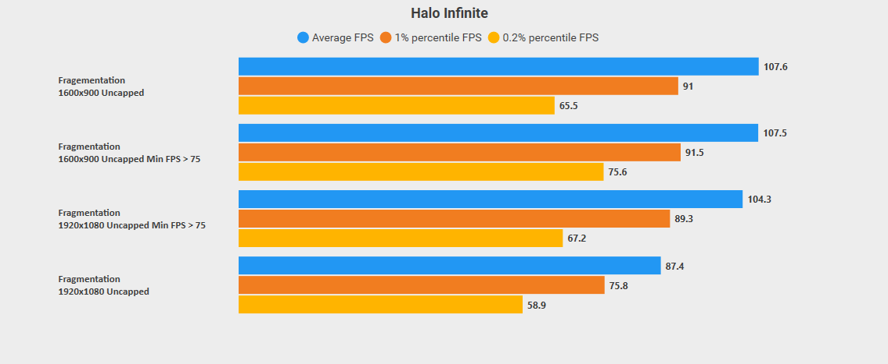
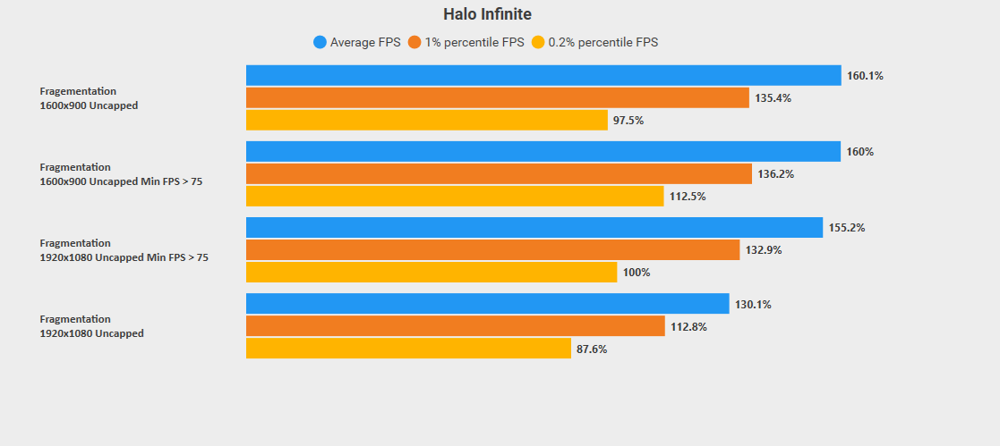

# What is this repository about?
I wanted to kind of document + research + see how the Minimum Framerate Option in Halo Infinite affects overall performance.

## What is Minimum Framerate? (DSR)
DSR or Dynamic Resolution Scaling is a feature in Halo Infinite which makes the game dynamically adjust the render resolution to hit said minimum framerate.          
Its kind of a hit or miss, DSR can also induce stuttering due the resolution being adjusted constantly, if it is struggling to maintain the minimum framerate.

## Testing DSR

### Let me go over the testing bench here:
System:
> i7-10700K       
> GTX 1650       
> 24 GB @ 2667 MHz      
> 75 Hz Monitor.

Halo Infinite Settings:
> Everything set to Low + Options which can be turned off are turned off.         
> Render Resolution > 71%   
> Sharpening: 100%         
> Sensory Effects are disabled.

Map:
> Fragmentation       
> Player was set to stand Idle, with their crosshair look directl at the structure.               

### Benchmarks

#### Fragementation: `Default Settings`

#### FPS

#### Percentage

#### Observations